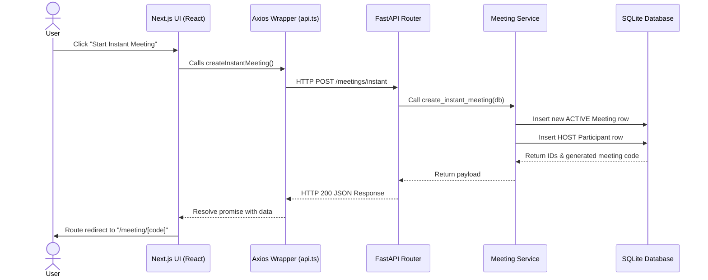

# Masterclass Guide: Zoom Clone Codebase & Architecture

Welcome! This guide is a complete, beginner-friendly walkthrough of the Zoom Clone codebase. Whether you are a total beginner to programming or new to this specific stack, this document will teach you the fundamentals of every technology used in this project and explain exactly how the code works—directory by directory, file by file, and layer by layer.

By the end of this guide, you will master:
1. **The Backend Tech Stack**: FastAPI, SQLAlchemy, SQLite, and Pydantic schemas.
2. **The Frontend Tech Stack**: Next.js 14 (App Router), TypeScript, Axios for API calls, and CSS Modules.
3. **Core Concept Integrations**: RESTful routing, database CRUD operations, State Management, dynamic routing (slugs/codes), and layout grids.

---

# Table of Contents
1. [Part 1: The Technology Stack Explained](#part-1-the-technology-stack-explained)
2. [Part 2: Project Folder Structures](#part-2-project-folder-structures)
3. [Part 3: Backend Code Deep Dive (Python & FastAPI)](#part-3-backend-code-deep-dive)
   - [Database Setup & Models](#database-setup--models)
   - [Schemas (Data Transfer Objects)](#schemas-data-transfer-objects)
   - [CRUD Operations (Database Access)](#crud-operations-database-access)
   - [Business Logic Services](#business-logic-services)
   - [API Routers & Controllers](#api-routers--controllers)
   - [Seed Data & Entrypoint](#seed-data--entrypoint)
4. [Part 4: Frontend Code Deep Dive (Next.js & TypeScript)](#part-4-frontend-code-deep-dive)
   - [API Integration layer (Axios)](#api-integration-layer-axios)
   - [Global & Component Layouts](#global--component-layouts)
   - [Reusable UI Components](#reusable-ui-components)
   - [App Pages & Dynamic Routes](#app-pages--dynamic-routes)
5. [Part 5: Master Summary of Flows](#part-5-master-summary-of-flows)

---

# Part 1: The Technology Stack Explained

Before looking at the files, let's understand the core technologies powering our Zoom Clone.

### 1. Python & FastAPI (Backend)
* **FastAPI**: A modern, high-performance web framework for building APIs with Python. It's built on top of Starlette (for web routing) and Pydantic (for data validation).
* **SQLAlchemy**: An Object-Relational Mapper (ORM). It allows us to write Python classes (Models) that map directly to database tables. We can write, read, and delete database records using standard Python code instead of raw SQL queries.
* **SQLite**: A lightweight, file-based database engine. It does not require a separate server process, making it perfect for development and small-scale apps. The database is saved as a local file named `zoom_clone_v2.db`.

### 2. LiveKit (WebRTC Video/Audio)
* **LiveKit Server**: An open-source WebRTC SFU (Selective Forwarding Unit) that handles routing video and audio streams between participants with extremely low latency.
* **@livekit/components-react**: A frontend library that provides React hooks and UI components (like `LiveKitRoom`, `VideoTrack`, and `useLocalParticipant`) to effortlessly connect the frontend to the LiveKit Server.
* **LiveKit Python SDK**: Used in the backend to generate secure JWT Access Tokens, granting frontend clients permission to publish and subscribe to streams in a specific meeting room.

### 3. Next.js, React & TypeScript (Frontend)
* **Next.js (App Router)**: A React framework for building full-stack web applications. It uses a folder-based routing structure (e.g., `app/calendar/page.tsx` becomes `http://localhost:3000/calendar`).
* **TypeScript**: A typed superset of JavaScript. It adds static types to our code, helping us catch bugs (like passing a number where a string is expected) before our code runs.
* **Axios**: A popular HTTP client library. We use it to send requests (GET, POST, PATCH, DELETE) from the frontend browser to our backend FastAPI server.
* **CSS Modules (Vanilla CSS)**: Files ending in `.module.css` (or regular `.css` imported directly into components) that let us write scoped styling, ensuring that styles for one page don't accidentally ruin the look of another.

---

# Part 2: Project Folder Structures

Here is a simplified bird's-eye view of how our files are organized.

```text
ZOOM_CLONE/
│
├── backend/                  # Python FastAPI application
│   ├── app/
│   │   ├── crud/             # Database queries (Create, Read, Update, Delete)
│   │   ├── models/           # SQLAlchemy DB Table Declarations
│   │   ├── routers/          # API route definitions (Endpoints)
│   │   ├── schemas/          # Pydantic models (Request/Response validators)
│   │   ├── services/         # Business logic layer
│   │   ├── utils/            # Helper functions (ID generators, security)
│   │   ├── database.py       # DB engine & Session setup
│   │   ├── main.py           # Application entrypoint & CORS config
│   │   └── seed.py           # Inserts mock database rows for testing
│   ├── requirements.txt      # Python dependencies list
│   └── zoom_clone.db         # The SQLite database file
│
└── frontend/                 # Next.js TypeScript application
    ├── src/
    │   ├── app/              # Next.js Routing pages and global styles
    │   │   ├── calendar/     # Calendar view
    │   │   ├── chat/         # Text chat channels
    │   │   ├── contacts/     # User contacts lists
    │   │   ├── join/         # Simple join-a-meeting form
    │   │   ├── login/        # Auth login flow page
    │   │   ├── meeting/[code]# DYNAMIC meeting room view (takes code slug)
    │   │   ├── meetings/     # Scheduled & recent meetings list
    │   │   ├── phone/        # Mock keypad dialer page
    │   │   ├── settings/     # App config settings tabs
    │   │   ├── layout.tsx    # Root layout template
    │   │   └── page.tsx      # Main landing/dashboard page
    │   ├── components/       # Reusable components (Sidebar, TopBar, Modals)
    │   └── lib/              # Client-side API wrappers & Typings
```

---

# Part 3: Backend Code Deep Dive

Let's dissect the backend files one by one.

## Database Setup & Models

### `backend/app/database.py`
This file configures the connection between Python and the SQLite database.
* **`create_engine`**: Connects to the database file (`sqlite:///./zoom_clone.db`). The argument `connect_args={"check_same_thread": False}` is required for SQLite to support multi-threaded FastAPI requests safely.
* **`sessionmaker`**: Creates a factory for database sessions. Each request gets its own session to perform database transactions.
* **`declarative_base()`**: The base class that all our database models (Tables) will inherit from.
* **`get_db()`**: A generator function. It yields a database session for a route, and guarantees that the connection is closed (`db.close()`) after the route returns its response, preventing connection leaks.

---

### `backend/app/models/user.py`
Defines the `users` table where user profiles are stored.
* **`User(Base)`**: Inherits from SQLAlchemy's base.
* **Columns**:
  * `id`: Unique integer ID (Primary Key).
  * `name`, `email`, `avatar`, `plan`: Basic user parameters.
  * `hashed_password`: A secured version of the user password.
  * `personal_meeting_id`: A unique string that acts as the user's permanent personal room ID.
  * `created_at` / `updated_at`: Timestamps configured to update automatically.
* **`meetings` relationship**: Links users to meetings they host. `cascade="all, delete"` ensures that if a user is deleted, all their scheduled meetings are also cleaned up.

---

### `backend/app/models/meeting.py`
Defines the `meetings` table.
* **Columns**:
  * `meeting_code`: The unique code (e.g., `abc-defg-hij`) used to join.
  * `status`: Can be `"SCHEDULED"`, `"ACTIVE"`, or `"COMPLETED"`.
  * `video_enabled`, `chat_enabled`, `screen_share_enabled`: Boolean flags containing settings for the room.
  * `host_id`: A Foreign Key pointing to the user who created it (`users.id`).
* **`participants` relationship**: Connects the meeting to the active participants joining.

---

### `backend/app/models/participant.py`
Defines the `participants` table. A participant is any user inside an active meeting.
* **Columns**:
  * `meeting_id`: Foreign Key pointing to the meeting (`meetings.id`).
  * `display_name`: The username typed when joining.
  * `role`: Can be `"HOST"` or `"PARTICIPANT"`.
  * `is_muted`: Flag for mic state.
  * `raised_hand` / `reaction`: Real-time interaction parameters.
  * `joined_at` / `left_at`: Track when a user joined and left (soft-delete tracking).

---

### `backend/app/models/message.py`
Defines the `messages` table which stores chat logs sent inside active meeting rooms.
* **Columns**:
  * `meeting_id`: The ID of the meeting where this message was typed.
  * `sender_id`: The ID of the participant who typed it. If the participant leaves and their record is deleted/cleared, `ondelete="SET NULL"` keeps the message history intact with sender marked as null.
  * `sender_name`: Cached name of the participant at the time they sent the message.
  * `content`: The text message string.

---

## Schemas (Data Transfer Objects)

Schemas in `backend/app/schemas/` use **Pydantic** to declare validation rules. They ensure data incoming to the server matches the expected format, and structure the outbound JSON payloads returned to the frontend.

For example, `ScheduleMeetingRequest` declares that scheduling a meeting requires a `title` (string), a `scheduled_at` (datetime), and a `duration` (integer). Pydantic parses the incoming request body, converts string datetimes into Python `datetime` objects, and throws a validation error if any fields are missing or of incorrect types.

---

## CRUD Operations (Database Access)

CRUD files contain simple functions that write or read from the database using the SQLAlchemy `Session`.

### `backend/app/crud/meeting.py`
* **`get_upcoming_meetings(db)`**: Queries `Meeting` objects where `status == "SCHEDULED"` sorted by date.
* **`get_meeting_by_code(db, code)`**: Looks up a single meeting based on its code.
* **`create_meeting(db, **kwargs)`**: Instantiates a `Meeting` model with the provided arguments, adds it to the session (`db.add`), saves it to disk (`db.commit`), and refreshes the instance to load default database fields like the auto-incremented `id`.
* **`update_meeting_status(db, meeting_id, status, ended_at)`**: Finds a meeting, updates its status/ended timestamp, and saves the change.

### `backend/app/crud/participant.py`
* **`add_participant(...)`**: Inserts a new participant row, timestamping `joined_at = datetime.now()`.
* **`get_participants_by_meeting(...)`**: Returns all participants in a meeting who have *not* left yet (`left_at.is_(None)`).
* **`remove_participant(...)`**: Performs a soft-delete by setting `left_at = datetime.now()`, marking the participant as offline.

---

## Business Logic Services

Services in `backend/app/services/` sit between the database adapters (CRUD) and the API controllers (routers). They handle the actual business rules of the application.

### `backend/app/services/meeting_service.py`
* **`create_instant_meeting(db)`**:
  1. Fetches a default logged-in user from the database.
  2. Generates a random meeting code (e.g., `xyz-pdq-abc`).
  3. Creates a meeting in the database with status set to `"ACTIVE"`.
  4. Automatically adds the host as the first participant with the role `"HOST"`.
  5. Returns details including a shareable URL.
* **`schedule_meeting(db, data)`**: Similar to instant meetings, but status is set to `"SCHEDULED"` and uses the date/time specified by the user.
* **`join_meeting(db, code, display_name)`**:
  1. Locates the meeting matching the code.
  2. If the meeting was `"SCHEDULED"`, switches its status to `"ACTIVE"` since someone is now starting/joining it.
  3. Creates a new participant row.
* **`end_meeting(db, code)`**: Updates the status to `"COMPLETED"` and logs the end timestamp.

---

## API Routers & Controllers

Routers define the actual HTTP endpoints.

### `backend/app/routers/meetings.py`
This file maps incoming HTTP requests to our services:
* **`@router.post("/instant")`**: Calls `create_instant_meeting` service.
* **`@router.post("/join")`**: Takes a JSON body containing `meeting_code` and `display_name`, calls `join_meeting`, and raises a `404` error if the meeting code does not exist.
* **`@router.get("/{code}/livekit-token")`**: Uses the `livekit.api.AccessToken` to generate a secure JWT. This token is required by the frontend's `<LiveKitRoom>` component to authenticate with the LiveKit server and stream audio/video for the specific participant.
* **`@router.patch("/{code}/end")`**: Ends the meeting.
* **`@router.patch("/participants/{participant_id}/mute")`**: Allows a host or the participant themselves to mute/unmute.
* **`@router.post("/{code}/messages")`**: Posts a chat message to the room's message log.

---

## Seed Data & Entrypoint

### `backend/app/seed.py`
When the backend starts up, it runs `seed_database()`. This function wipes any existing tables and populates the database with clean mock data (a default user, upcoming calendar events, recent meeting logs, and fake contacts) so the app has data right away.

### `backend/app/main.py`
The backend hub:
* Runs database migrations (`Base.metadata.create_all(bind=engine)`).
* Triggers the seed generator.
* Configures **CORS** (Cross-Origin Resource Sharing) middleware, permitting our frontend (running on `http://localhost:3000`) to communicate with the backend API.
* Imports and includes the modular routes (`auth_router`, `dashboard_router`, `meetings_router`).

---

# Part 4: Frontend Code Deep Dive

Now let's explore the frontend client written in Next.js.

## API Integration Layer

### `frontend/src/lib/api.ts`
All communications with the backend FastAPI server pass through this file using **Axios**.
* **`axios.create`**: Declares a base URL (e.g. `http://localhost:8000`).
* **Request Interceptor**: A middleware running before every single API call. It checks browser local storage for `"zoom_user"`. If found, it automatically attaches a custom header `X-User-Id` containing the logged-in user's ID. The backend reads this header to determine who is making the request.
* **Named Exports**: Functions like `getDashboard()`, `createInstantMeeting()`, and `joinMeeting(data)` wrap standard Axios request methods (`api.get`, `api.post`, `api.patch`) in clean async functions.

---

## Global & Component Layouts

### `frontend/src/app/layout.tsx`
The primary wrapper layout for the entire client. Every page load is rendered inside this template.
* It defines HTML metadata (Title, Description).
* It loads the Google Font **Inter** and applies it globally.
* It imports `globals.css` to inject standard visual baselines.
* It embeds the reusable `Sidebar` and `TopBar` layout components so they remain static on screen while the inner pages change.

---

## Reusable UI Components

Located in `frontend/src/components/`, these are the modular building blocks of our interface.

### `Sidebar.tsx` & `Sidebar.css`
The left-hand navigation panel.
* Maps over navigation routes: Home, Meetings, Calendar, Contacts, Settings, Chat, Phone.
* Matches the browser's current path using Next.js's `usePathname()` hook to apply an `.active` CSS class to the selected tab.

### `TopBar.tsx` & `TopBar.css`
The header bar containing:
* A real-time clock updating every second using a standard React `useEffect` interval.
* The user profile avatar and status indicator.

### Modals (`NewMeetingModal.tsx`, `JoinModal.tsx`, `ScheduleModal.tsx`)
These display as overlays when users trigger action buttons on the home screen.
* **`NewMeetingModal`**: Allows starting an instant meeting or copying a personal link. Clicking "Start" calls `createInstantMeeting()` and redirects the user to `/meeting/[code]`.
* **`JoinModal`**: Prompts the user to enter a meeting code and screen name, then logs them in as a participant.
* **`ScheduleModal`**: Form containing inputs for Title, Description, Date/Time, and Duration. Submits details to the backend to insert a calendar event.

---

## App Pages & Dynamic Routes

Pages represent specific views.

### `frontend/src/app/page.tsx` (Dashboard)
The landing dashboard that users see upon logging in.
* Displays 4 quick action buttons (New Meeting, Join, Schedule, Share Screen).
* Fetches overview counters (upcoming meetings, logs) from the backend dashboard service when the page mounts.
* Integrates layout grids to align actions and calendar events.

---

### `frontend/src/app/meeting/[code]/page.tsx` (Dynamic Meeting Room)
This is the dynamic meeting interface. Next.js maps URLs like `http://localhost:3000/meeting/abc-defg-hij` to this page, passing `"abc-defg-hij"` in the page parameters as `code`.

This view acts as a full-featured real-time video conference layout powered by **LiveKit**:
1. **LiveKit Integration**:
   * Wraps the entire layout in `<LiveKitRoom>`, passing the `token` fetched from the backend and the `serverUrl`.
   * Automatically handles connecting to the WebRTC server, acquiring camera/microphone permissions, and routing media tracks.
2. **State Polling Hooks**:
   * `participants`: Tracks current users in the room. Polling the backend every few seconds ensures we capture database-level state changes like host mutes or hand raises.
   * `messages`: Message list for chat.
3. **Sub-components**:
   * **`VideoGrid.tsx`**: Renders `<ParticipantTile>` and video tracks for all active LiveKit participants, dynamically adjusting grid layouts.
   * **`MeetingToolbar.tsx`**: Contains buttons to mute/unmute audio, toggle video feed, raise hand, select emoji reactions, or end/leave the call. Uses LiveKit's `useLocalParticipant()` hook to actually disable the hardware camera/mic.
   * **`ParticipantsPanel.tsx`**: Sidebar listing all attendees. If the user is the host, they are shown buttons to kick or mute participants.
   * **`ChatPanel.tsx`**: Displays the live message stream and text inputs.

---

# Part 5: Master Summary of Flows

To solidify your understanding, let's trace exactly what happens when a user clicks **"New Meeting"**:



When the page redirects to `/meeting/[code]`, two things happen simultaneously:
1. **LiveKit Connection**:
   * The frontend requests a token (`GET /meetings/{code}/livekit-token`).
   * The backend generates a secure JWT using the LiveKit API Key.
   * The frontend mounts `<LiveKitRoom>` with the token, instantly establishing a WebRTC video/audio connection to the LiveKit server.
2. **State Polling**:
   * Every 2 seconds, the frontend polls `GET /meetings/{code}`.
   * It updates the React states for `participants` and `messages`.
   * The UI automatically updates to reflect new participants, muted mics (enforced remotely by host), raised hands, and chat messages.

---
*Now you are ready to explore the code! Click any of the file links in the guide to see the implementation details.*
